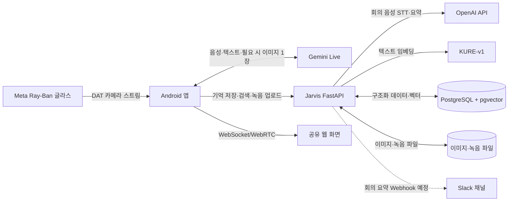
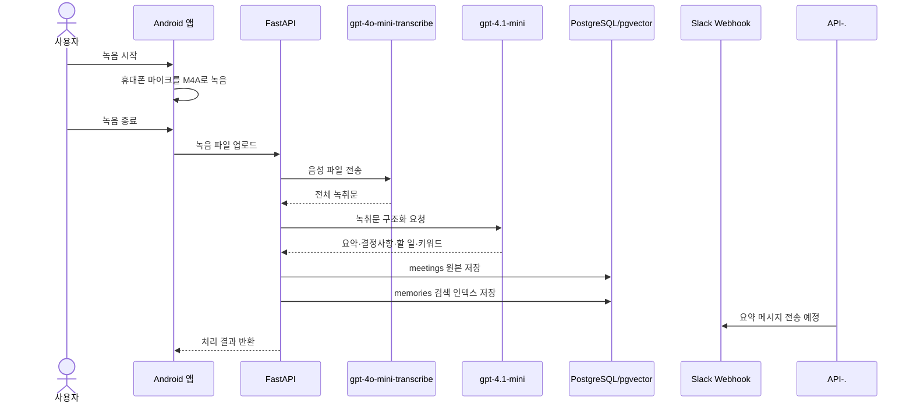
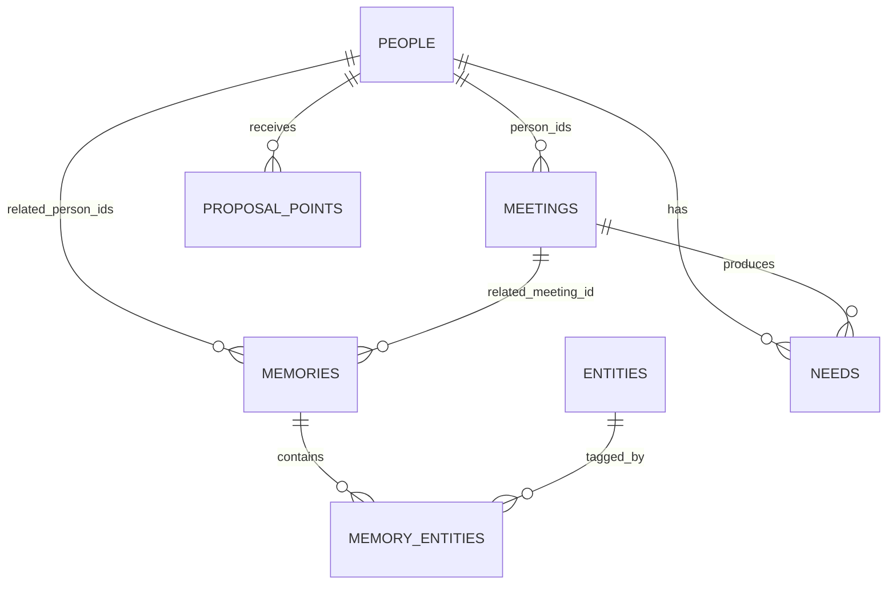
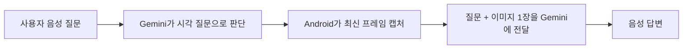
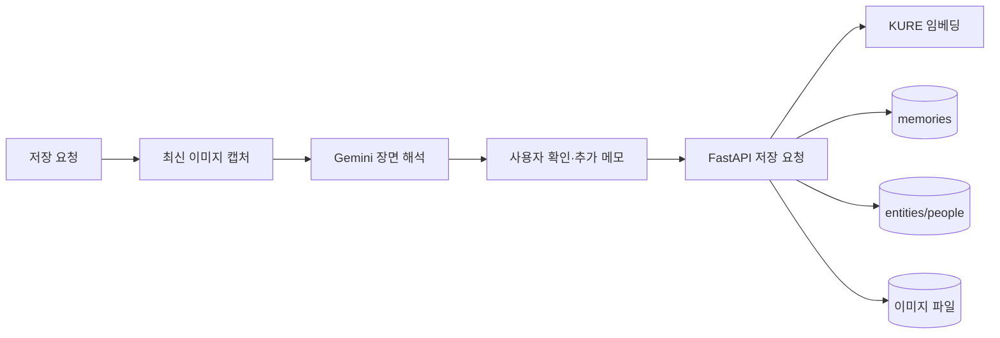
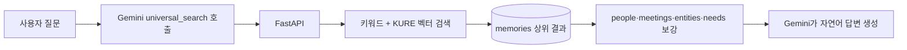

# Jarvis OS 현재 구현 기능

최종 업데이트: 2026-06-10

## 1. 프로젝트 구성

| 저장소 | 역할 |
|---|---|
| `JarvisAndroidClient` | Meta Ray-Ban 글라스 카메라 연동, Gemini 음성 대화, 이미지 캡처, 기억 저장·검색, 회의 녹음 |
| `JarvisMemoryServer` | FastAPI API, PostgreSQL·pgvector 저장소, KURE 임베딩, OpenAI STT·회의 요약 |

### 전체 아키텍처



### 구성요소 역할

| 구성요소 | 책임 |
|---|---|
| Meta Ray-Ban 글라스 | 카메라 영상 입력 |
| Android 앱 | 영상 표시, 음성 인터페이스, 최신 이미지 캡처, 회의 녹음, 백엔드 호출 |
| Gemini Live | 사용자 의도와 도구 호출 판단, 음성 대화, 이미지 이해, 검색 결과 설명 |
| FastAPI | 데이터 검증, 저장·검색, 회의 처리, 외부 서비스 연동 |
| KURE-v1 | 기억·회의·객체 검색용 한국어 임베딩 생성 |
| PostgreSQL + pgvector | 구조화 데이터와 벡터 저장 |
| OpenAI API | 회의 녹음 STT와 구조화 요약 |
| Slack Incoming Webhook | 회의 요약을 지정 채널에 알림으로 전송하는 확장 지점 |

## 2. 현재 가능한 사용자 기능

### 글라스 시야 확인

- Meta Ray-Ban 글라스 카메라 영상을 Android 앱에서 확인할 수 있습니다.
- 사용자가 현재 보고 있는 대상에 관해 질문하면 최신 프레임을 캡처합니다.
- 캡처한 이미지와 음성 질문을 Gemini에 전달해 음성으로 답변합니다.
- 지속적인 비디오 전체를 Gemini에 전송하지 않고, 시각 정보가 필요한 시점의 이미지만 전송합니다.

예시:

> "지금 앞에 있는 자동차가 뭐야?"

앱은 질문 종료를 감지한 뒤 최신 이미지를 캡처하고, 이미지와 질문을 함께 Gemini에 전달합니다.

### 일상 기억 저장

- 사용자가 "이거 저장해줘"라고 요청하면 현재 시야의 이미지를 캡처합니다.
- AI가 장면을 설명하고 저장할 내용이 맞는지 확인합니다.
- 사용자의 추가 메모를 받아 다음 정보를 저장합니다.
  - 한국 시간 기준 날짜와 시간
  - 사용자 메모
  - AI 장면 해석
  - 객체·사람·장소 등의 라벨과 메타데이터
  - 캡처 이미지 경로
  - 검색용 텍스트 임베딩
- 저장 완료 후 어떤 내용으로 저장했는지 알려줍니다.

### 과거 기억 검색

- 과거 사람, 물건, 명함, 장소, 미팅을 하나의 통합 기억 검색으로 조회합니다.
- 질문을 텍스트 쿼리로 변환하고 `memories`에서 키워드 검색과 벡터 유사도 검색을 함께 수행합니다.
- 상위 결과에 연결된 사람, 미팅, 객체, 요구사항 데이터를 조합해 답변용 문맥을 만듭니다.
- Gemini가 검색 결과를 바탕으로 자연스러운 음성 답변을 생성합니다.

예시:

> "지난주에 본 빨간 자동차 어디서 봤지?"

> "전에 저장한 명함의 담당자가 누구였지?"

### 명함과 사람 정보 저장

- 명함 이미지는 일반 기억으로 저장하면서 사람·회사·연락처 정보를 구조화합니다.
- 추출한 사람 정보는 `people` 데이터와 연결합니다.
- 이후 명함, 회사명, 사람 이름 중 어느 표현으로 질문해도 통합 기억 검색으로 찾을 수 있습니다.

### 회의 녹음, STT, 요약

- Gemini 연결과 별개로 Android 앱의 마이크를 사용해 회의를 녹음합니다.
- 화면 하단 마이크 버튼을 누르면 녹음을 시작하고, 다시 누르면 종료합니다.
- 음성은 AAC/M4A 형식으로 저장한 뒤 백엔드로 업로드합니다.
- `gpt-4o-mini-transcribe`가 한국어 음성을 텍스트로 변환합니다.
- `gpt-4.1-mini`가 회의 제목, 요약, 결정사항, 할 일, 사람, 회사, 키워드를 구조화합니다.
- 결과는 `meetings`와 통합 검색용 `memories`에 함께 저장됩니다.

회의 처리 흐름:



### 실시간 화면 공유

- 글라스 영상을 앱 외부의 웹 화면으로 공유하는 기능이 구현되어 있습니다.
- 현재 로컬 IP 주소를 사용하는 경우 같은 Wi-Fi 네트워크에서만 접속할 수 있습니다.
- 외부 인터넷 공유에는 공인 HTTPS/WSS 서버, VPN 또는 터널 구성이 추가로 필요합니다.

## 3. AI 요청 분기

사용자의 자연어 요청을 Gemini가 해석하고 필요한 도구를 선택합니다.

| 요청 종류 | 처리 방식 |
|---|---|
| 일반 대화 | Gemini 음성 대화 |
| 현재 시야 질문 | 최신 이미지 캡처 후 이미지와 질문 전달 |
| 현재 장면 저장 | 이미지 해석, 사용자 확인·메모, 백엔드 저장 |
| 과거 기억 질문 | 통합 기억 검색 후 검색 결과를 Gemini가 설명 |
| 회의 녹음 | 앱의 독립 녹음 기능과 OpenAI STT·요약 사용 |

비용 절감을 위해 Gemini에는 전체 비디오 스트림을 보내지 않고 음성, 텍스트, 필요한 시점의 단일 이미지만 전달합니다.

## 4. 백엔드 데이터 구조

| 데이터 | 역할 |
|---|---|
| `memories` | 모든 기억의 공통 검색 인덱스. 원문, 요약, JSON 메타데이터, 이미지 경로, 임베딩 저장 |
| `people` | 이름, 회사, 직책, 연락처 등 사람의 정규화된 정보 |
| `meetings` | 회의 원문, 요약, 결정사항, 할 일 등 |
| `entities` | 물건, 장소, 명함, 조직 등 기억에서 추출한 객체 |
| `needs` | 사람·미팅과 연결된 요구사항 |
| `proposal_points` | 제안 생성에 사용하는 영업 문맥 |

검색은 먼저 `memories`에서 수행합니다. 검색된 기억의 유형과 연결 ID를 사용해 관련 테이블 데이터를 보강하므로, 질문 단계에서 테이블을 임의로 하나만 선택하지 않습니다.

### 테이블 관계



### 회의 데이터가 저장되는 위치

회의는 `entities`에 넣지 않습니다.

1. `meetings`에는 회의의 기준 데이터가 저장됩니다.
   - 제목
   - 시작·종료 시간
   - 참여자 ID
   - 전체 녹취문
   - 요약
   - 결정사항·할 일·회사·키워드 JSON
   - 녹음 파일 경로와 사용 모델
   - 요약 임베딩
2. `memories`에는 해당 회의를 통합 검색하기 위한 검색 문서가 추가됩니다.
   - `memory_type = meeting_recording`
   - 요약, 결정사항, 할 일, 녹취문을 합친 검색 텍스트
   - KURE 임베딩
   - `related_meeting_id`로 원본 `meetings` 행 연결
3. `entities`는 사람, 회사, 명함, 물건, 장소처럼 장면이나 기억에서 식별한 객체를 저장합니다.
4. 현재 회의 요약에서 추출된 회사·키워드는 `meetings.metadata`와 `memories.metadata`에 JSON으로 저장되며, 자동으로 `entities` 행을 만들지는 않습니다.

따라서 회의 검색은 `memories`에서 유사한 검색 문서를 찾고, `related_meeting_id`를 따라 `meetings`의 전체 녹취문과 구조화 요약을 가져오는 방식입니다.

### 임베딩

- 모델: `nlpai-lab/KURE-v1`
- 실행 위치: 백엔드 서버
- 텍스트 벡터: 1024차원
- 얼굴 벡터 호환 영역: 512차원
- 저장소: PostgreSQL + pgvector

## 5. 주요 API

| API | 기능 |
|---|---|
| `POST /memory` | 일상 기억 저장 |
| `POST /memory/universal-search` | 사람·물건·명함·미팅 통합 검색 |
| `POST /people` | 사람 정보 저장 |
| `POST /meetings` | 미팅 정보 저장 |
| `POST /meetings/recordings` | 녹음 파일 STT, 요약, 미팅·기억 저장 |
| `GET /health` | 백엔드와 임베딩 모델 상태 확인 |
| `/live/ws` | 실시간 화면 공유 WebSocket |

전체 API는 서버 실행 후 `http://localhost:8000/docs`에서 확인할 수 있습니다.

## 6. 주요 기능별 데이터 흐름

### 현재 시야 질문



### 일상 기억 저장



### 과거 기억 검색



## 7. Slack 회의 요약 연동

### 요금제

Incoming Webhook 사용 자체에 Slack 유료 요금제가 필수는 아닙니다. Slack Free 요금제에서도 앱을 설치해 Webhook으로 채널에 메시지를 보낼 수 있습니다.

Free 요금제의 주요 제한:

- 워크스페이스당 앱 통합 최대 10개
- 메시지 검색 기록 90일
- 워크스페이스 관리자가 앱 설치 또는 Incoming Webhook을 제한하면 관리자 승인이 필요

우리 서버가 STT와 요약을 수행한 뒤 결과 텍스트만 Slack으로 보내므로 Slack AI 유료 기능은 사용하지 않습니다. 비용은 Slack이 아니라 OpenAI STT·요약 호출에서 발생합니다.

### 권장 구현

```text
POST /meetings/recordings
  -> STT
  -> 요약
  -> meetings + memories 트랜잭션 저장
  -> 저장 성공 후 Slack Incoming Webhook 호출
```

Slack 메시지 권장 항목:

- 회의 제목과 시간
- 핵심 요약
- 결정사항
- 후속 작업
- 참석자·회사
- 전체 내용 조회용 앱 링크

환경 변수:

```dotenv
SLACK_WEBHOOK_URL=https://hooks.slack.com/services/...
SLACK_MEETING_NOTIFICATIONS_ENABLED=true
```

Webhook URL은 비밀키이므로 `.env`에서만 관리하고 Git에 커밋하지 않습니다. 전송 실패가 회의 DB 저장까지 실패시키지 않도록 저장 완료 후 별도로 전송하며, 실패 내역은 로그 또는 재시도 큐에 남기는 구조가 적절합니다.

참고:

- [Slack Incoming Webhooks](https://docs.slack.dev/messaging/sending-messages-using-incoming-webhooks/)
- [Slack 요금제](https://slack.com/pricing)

## 8. 사용 모델

| 용도 | 모델 |
|---|---|
| 실시간 음성 대화와 이미지 이해 | Gemini Live |
| 기억 검색 임베딩 | KURE-v1 |
| 회의 STT | `gpt-4o-mini-transcribe` |
| 회의 요약 | `gpt-4.1-mini` |

## 9. 현재 제한사항

- 시각 질문은 음성과 이미지가 완전히 같은 순간에 생성되는 구조가 아니므로, 질문 종료 후 최신 프레임 확보를 위한 짧은 대기 시간이 있습니다.
- 글라스 영상의 화질과 지연은 DAT SDK가 제공하는 스트림 품질, Bluetooth/Wi-Fi 상태, 휴대폰 디코딩 성능의 영향을 받습니다.
- 회의 녹음은 현재 휴대폰 마이크를 사용하며 화자 분리 기능은 없습니다.
- 회의 녹음 업로드 한도는 25MB입니다. 현재 32kbps 설정 기준 약 1시간 녹음은 약 14.4MB입니다.
- 앱이 종료되거나 운영체제가 프로세스를 정리하면 진행 중인 녹음이 유지되지 않을 수 있습니다.
- 로컬 실시간 공유 링크는 같은 네트워크에서만 접근할 수 있습니다.
- 캘린더, 메일, Notion 등 외부 서비스 연동은 아직 구현 대상입니다.
- Slack Webhook은 설계와 연동 지점만 문서화된 상태이며 실제 전송 코드는 아직 추가되지 않았습니다.

## 10. 테스트 방법

### 현재 시야 질문

1. 글라스 스트리밍을 시작합니다.
2. AI 버튼으로 Gemini 대화를 시작합니다.
3. "지금 내가 보고 있는 물건이 뭐야?"라고 질문합니다.
4. 캡처된 최신 이미지를 기준으로 음성 답변하는지 확인합니다.

### 기억 저장과 검색

1. "지금 보는 장면 저장해줘"라고 말합니다.
2. AI의 장면 설명을 확인하고 추가로 저장할 내용을 말합니다.
3. 저장 완료 안내를 확인합니다.
4. 다른 시점에 저장한 사람, 물건, 장소의 특징으로 질문합니다.
5. 통합 검색 결과를 기반으로 답변하는지 확인합니다.

### 회의 녹음

1. 화면 하단 마이크 버튼을 누릅니다.
2. 회의를 진행한 뒤 빨간 정지 버튼을 누릅니다.
3. STT와 요약 처리 완료 안내를 기다립니다.
4. 과거 기억 검색으로 회의 내용, 결정사항 또는 할 일을 질문합니다.

## 11. 보안

- Gemini, OpenAI, GitHub 토큰은 Git에 커밋하지 않습니다.
- Android 비밀값은 `local.properties`와 `Secrets.kt`에서 관리합니다.
- 백엔드 비밀값은 `jarvis-server/.env`에서 관리합니다.
- 위 파일들은 `.gitignore` 대상입니다.

## 12. 검증 상태

- Android Debug 빌드 검증
- 백엔드 Python 문법 검증
- 실제 음성 파일을 사용한 OpenAI STT 호출 검증
- STT 결과를 사용한 `gpt-4.1-mini` 구조화 요약 검증
- 회의와 통합 기억 DB 저장 검증
